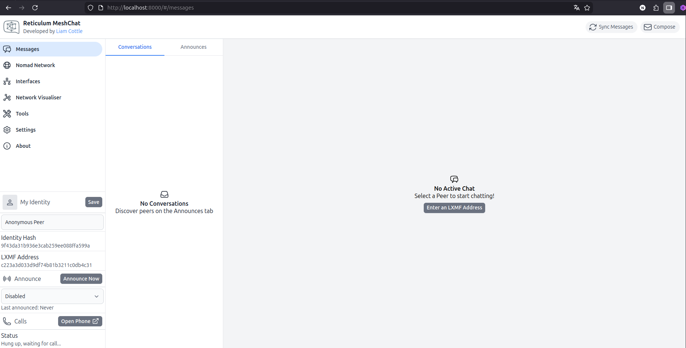

# Reticulum MeshChat

## О Reticulum MeshChat

**Reticulum MeshChat** - это десктопное приложение, позволяющее построить коммуникацию между пользователями сети **Reticulum**.



## Установка

[Если вы не хотите заморачиваться, то здесь можете скачать приложения под вашу систему](docs/SOFTWARE.md)

[Если у вас не установлен git](docs/GIT.md)

[Если у вас не установлен make](docs/MAKE.md)

[Если у вас не установлен docker](docs/DOCKER.md)

1. Клонируем репозиторий в нужную директорию

```bash
git clone git@github.com:MaksimovichDV/reticulum-meshchat.git
```

2. Переходим в директорию проекта

```bash
cd reticulum-meshchat
```

3. Запускаем проект 
```bash
make up
```

Рекомендуется использовать браузер Chromium или основанных на нем.

Открываем проект в браузере [тыц](http://localhost:8000)

## Возможности проекта
В разработке

## Часто задаваемые вопросы

[FAQ](docs/FAQ.md)

## Контакты
1. Моя группа в [Telegram](https://t.me/reticulum_nvrsk)
2. Мой сайт (в разработке)

## Разное

Все предложения, замечания и критику можно оставить [тут](https://github.com/MaksimovichDV/reticulum-meshchat/issues)
